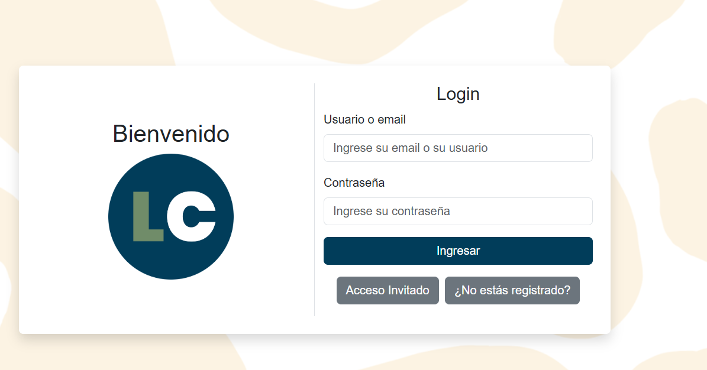
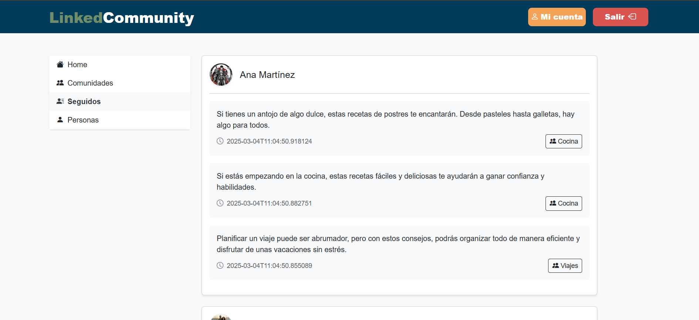
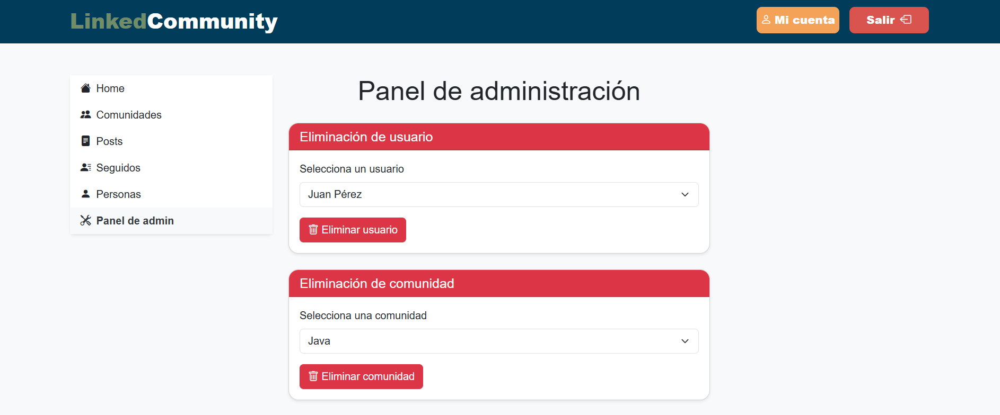

# SSDD

## **GROUP: 3**

| Name                   | Email                                |
|:------------------------:|:------------------------------------:|
| PABLO MARINAS BARBA      | <p.marinas.2019@alumnos.urjc.es>      |
| ALONSO DÍAZ SERRANO      | <a.diaz.2019@alumnos.urjc.es>        |
| NICOLAS VELEZ LEAL       | <n.velez.2017@alumnos.urjc.es>       |
| SERGIO ESPINOSA ROBLES   | <s.espinosa.2020@alumnos.urjc.es>    |

## **MEMBERS PARTICIPATION**

Cada miembro del equipo debe documentar su contribución a la práctica, incluyendo:

### PABLO MARINAS BARBA

- **Tareas realizadas:**
  
El proyecto ha sido desarrollado en equipo, organizándonos de manera paralela para avanzar de forma coordinada. En mi caso, me centré en la gestión del borrado de elementos, incluyendo usuarios, publicaciones y comunidades. Además, trabajé en el diseño y funcionamiento de la base de datos para garantizar que, al insertar datos, las tablas y relaciones se generaran correctamente. También me aseguré de que al eliminar un usuario, sus publicaciones y comunidades se eliminaran adecuadamente, basandome en la integracion de las relaciones entre entidades.

Dado que trabajamos en equipo, aunque algunos commits fueron realizados por un solo integrante, todos participamos activamente en la mayoría de los cambios. En varias ocasiones, trabajamos juntos desde uno o dos ordenadores para facilitar la comunicación y comprensión de las modificaciones en el código. Por ello, también colaboré en la creación de clases, configuración de servidores, archivos de configuración, plantillas y otros elementos clave del proyecto.

- **Commits más significativos:**
  1. [Creation of Services and relations](https://github.com/SSDD-2025/practica-sistemas-distribuidos-2025-grupo-3/commit/e7bed9770e6e3f8601c2f716a87d2a7a08717557)
  2. [Change of deletePost ot be on Service](https://github.com/SSDD-2025/practica-sistemas-distribuidos-2025-grupo-3/commit/4dc26ae6ebc95050a78b41988d9e80a0625501bc)
  3. [Delete of Posts](https://github.com/SSDD-2025/practica-sistemas-distribuidos-2025-grupo-3/commit/fc084ed554d4d64feefb25274b7eb5b9b359c525)
  4. [Creación de Base de datos](https://github.com/SSDD-2025/practica-sistemas-distribuidos-2025-grupo-3/commit/424b483386adc03e39f22df7d9c01a4aecb24907)
  5. [Merge branch 'main' of https://github.com/SSDD-2025/practica-sistemas-distribuidos-2025-grupo-3](https://github.com/SSDD-2025/practica-sistemas-distribuidos-2025-grupo-3/commit/ece8cf8dcd8fee3ab0d772dd27464d45a7650bca)

- **Ficheros con mayor participación:**
  1. [CommunityService.java](https://github.com/SSDD-2025/practica-sistemas-distribuidos-2025-grupo-3/blob/main/src/demo/src/main/java/com/example/demo/Service/CommunityService.java)
  2. [CommunityController.java](https://github.com/SSDD-2025/practica-sistemas-distribuidos-2025-grupo-3/blob/main/src/demo/src/main/java/com/example/demo/Controller/CommunityController.java)
  3. [Post.java](https://github.com/SSDD-2025/practica-sistemas-distribuidos-2025-grupo-3/blob/main/src/demo/src/main/java/com/example/demo/model/Post.java)
  4. [Community.java](https://github.com/SSDD-2025/practica-sistemas-distribuidos-2025-grupo-3/blob/main/src/demo/src/main/java/com/example/demo/model/Community.java)
  5. [application.properties](https://github.com/SSDD-2025/practica-sistemas-distribuidos-2025-grupo-3/blob/main/src/demo/src/main/resources/application.properties)

- **Tareas realizadas en la segunda parte del proyecto:**

  En esta parte me centré en la realización de consultas con Postman para poder replicar desde la API REST todas las funcionalidades disponibles en la web. Este proceso me llevó bastante tiempo, ya que tuve que apoyarme en la documentación mientras desarrollaba los DTOs necesarios para realizar las consultas de forma correcta y personalizada, en función de la cantidad de información que necesitaba obtener.
  
  También surgieron algunos problemas relacionados con la seguridad, en los que fue necesario establecer distinciones claras entre los roles de Admin y Guest, con el fin de restringir adecuadamente las acciones que puede realizar cada usuario. Además, trabajamos con diversas relaciones entre entidades para poder obtener los posts de un usuario o de una comunidad junto con sus datos correspondientes.

- **Commits más significativos en la segunda parte del proyecto:**

  1. [Changes on delete user so the user can delete his own](https://github.com/SSDD-2025/practica-sistemas-distribuidos-2025-grupo-3/commit/e254e1072f7eed4a007a69798792123b08fac9a9)
  2. [Creation of Get Comments and Comment form user in Api](https://github.com/SSDD-2025/practica-sistemas-distribuidos-2025-grupo-3/commit/31bff0eacb9c82cb4cef8b400d618b7abebf6338)
  3. [Making change of Api to make get form postman](https://github.com/SSDD-2025/practica-sistemas-distribuidos-2025-grupo-3/commit/14ac00eb79da90903218ba12c7f8121affa72f0b)
  4. [Only the own user can change his profile](https://github.com/SSDD-2025/practica-sistemas-distribuidos-2025-grupo-3/commit/80f0ec28287dc816599e8faa494557484e51bcfc)
  5. [Creation of getAllPosts](https://github.com/SSDD-2025/practica-sistemas-distribuidos-2025-grupo-3/commit/4b91a0730d47a8a78e4a9eb111cdb7cfdda232b0)

- **Ficheros con mayor participación en la segunda parte del proyecto:**
  1. [ComunityRestController.java](https://github.com/SSDD-2025/practica-sistemas-distribuidos-2025-grupo-3/blob/main/src/demo/src/main/java/com/example/demo/RESTController/ComunityRestController.java)
  2. [CommentMapper.java](https://github.com/SSDD-2025/practica-sistemas-distribuidos-2025-grupo-3/blob/main/src/demo/src/main/java/com/example/demo/DTO/Comment/CommentMapper.java)
  3. [PostDTORest.java](https://github.com/SSDD-2025/practica-sistemas-distribuidos-2025-grupo-3/blob/main/src/demo/src/main/java/com/example/demo/DTO/Post/PostDTORest.java)
  4. [CommentRestController.java](https://github.com/SSDD-2025/practica-sistemas-distribuidos-2025-grupo-3/blob/main/src/demo/src/main/java/com/example/demo/RESTController/CommentRestController.java)
  5. [UserRestController.java](https://github.com/SSDD-2025/practica-sistemas-distribuidos-2025-grupo-3/blob/main/src/demo/src/main/java/com/example/demo/RESTController/UserRestController.java)

  ### ALONSO DIAZ SERRANO

- **Tareas realizadas:**
  - [Estructura básica (estilo) de como orientar la página, entidad comentario hecha, refactorizacion sobre logica de controlador-servicio-repositorio]
  - [Extra: hay algun tipo de problema con mi cuenta y los commits que hago desde el portatil y los commits que hago desde mi ordenador de escritorio de casa, hay como dos cuentas distintas de Alonso haciendo commits]

- **Commits más significativos:**
  1. [Create a comment](https://github.com/SSDD-2025/practica-sistemas-distribuidos-2025-grupo-3/commit/d58b4fee87292581ce1ac6d53d1b774d35c75608)
  2. [Show Comments and Delete](https://github.com/SSDD-2025/practica-sistemas-distribuidos-2025-grupo-3/commit/e321b5d59fb92dfbc49cbe1889b3d5ec9dd2a6a1)
  3. [Refactor Controller-Service-Repository](https://github.com/SSDD-2025/practica-sistemas-distribuidos-2025-grupo-3/commit/0109b6195b8995777e9520fdbda85b114708f2bc)
  4. [DataLoader added, added model Post and Comunity with their service, hall and post controller modified](https://github.com/SSDD-2025/practica-sistemas-distribuidos-2025-grupo-3/commit/283aab639907cd3da04bfb45f08ee8c318826d56)
  5. [New "Home" page with basic structure and created the  styles.css file.](https://github.com/SSDD-2025/practica-sistemas-distribuidos-2025-grupo-3/commit/3efccc357124f58a097e896dd74fd04ee618172a)

- **Ficheros con mayor participación:**
  1. [CommunityController.java](https://github.com/SSDD-2025/practica-sistemas-distribuidos-2025-grupo-3/blame/main/src/demo/src/main/java/com/example/demo/Controller/CommunityController.java)
  2. [community.html](https://github.com/SSDD-2025/practica-sistemas-distribuidos-2025-grupo-3/blame/main/src/demo/src/main/resources/templates/community.html)
  3. [CommunityService.java](https://github.com/SSDD-2025/practica-sistemas-distribuidos-2025-grupo-3/blob/main/src/demo/src/main/java/com/example/demo/Service/CommunityService.java)
  4. [CommentService.java](https://github.com/SSDD-2025/practica-sistemas-distribuidos-2025-grupo-3/blob/main/src/demo/src/main/java/com/example/demo/Service/CommentService.java)
  5. [CommentController.java](https://github.com/SSDD-2025/practica-sistemas-distribuidos-2025-grupo-3/blob/main/src/demo/src/main/java/com/example/demo/Controller/CommentController.java)

  ### NICOLAS VELEZ LEAL

- **Tareas realizadas:**
  - Creacion de la estructura básica de funcinamiento de la web. Mejora de la primera versión navegable.
  - Navegavión del sitio a través del web controller.
  - Creacion del sistema de subida de posts con sus imágenes.
  - Constante mejora de estilos y creacion y reestructuración de los html.

- **Commits más significativos:**
  1. [Posts and DB update](https://github.com/SSDD-2025/practica-sistemas-distribuidos-2025-grupo-3/commit/62bbd6473b29ddc5e8060771fccfedc9114fe4b4)
  2. [Posts update](https://github.com/SSDD-2025/practica-sistemas-distribuidos-2025-grupo-3/commit/12efa023d02283a5bca94f90acb39ca13f14c107)
  3. [Users update](https://github.com/SSDD-2025/practica-sistemas-distribuidos-2025-grupo-3/commit/7ef3ca1a62348911d09964b1e9d2601ff00517c1)
  4. [Errors handler](https://github.com/SSDD-2025/practica-sistemas-distribuidos-2025-grupo-3/commit/d9a67669fecf0ced26332e87855a6539b28b598f)
  5. [Followers update](https://github.com/SSDD-2025/practica-sistemas-distribuidos-2025-grupo-3/commit/fe1fdbfd5ec33beacd5845c0e8839bfe1fd0a532)

- **Ficheros con mayor participación:**
  1. [Web Controller (Java)](src/demo/src/main/java/com/example/demo/Controller/WebController.java)
  2. [Post Controller (Java)](src/demo/src/main/java/com/example/demo/Service/PostService.java)
  3. [Home (HTML)](src/demo/src/main/resources/templates/home.html)
  4. [Community (HTML)](src/demo/src/main/resources/templates/community.html)
  5. [Styles (CSS)](src/demo/src/main/resources/static/css/style.css)

  ### SERGIO ESPINOSA ROBLES

- **Tareas realizadas:**
  - Principalmente me centre en el trabajo sobre usuarios, tanto la parte de registro como la parte de edición
  de manera que tuvieramos asegurado un correcto funcionamiento de usuarios que pudiera reflejarse en el resto
  de aspectos, como la correcta visualización de los usuarios en sus posts de una comunidad(siendo esto ultimo
  mayormente desarrollado por Nico).

- **Commits más significativos:**
  1. [Merging branchs from Pablo and myself](https://github.com/SSDD-2025/practica-sistemas-distribuidos-2025-grupo-3/commit/b6159eea70383881fefcc01a386193852786db6d)
  2. [User registration fully implemented, customized existing (email or user) error pending](https://github.com/SSDD-2025/practica-sistemas-distribuidos-2025-grupo-3/commit/16ee1e318aa71413d5e9f5ac328d4f0329410313)
  3. [Added the possibility to edit the user's profile](https://github.com/SSDD-2025/practica-sistemas-distribuidos-2025-grupo-3/commit/ed0a8aa1662ec35ee60133ef5dc760898ca0b303)
  4. [Now its possible to log in either with the email or the username](https://github.com/SSDD-2025/practica-sistemas-distribuidos-2025-grupo-3/commit/0f193128f85eaef47293b625ae3b32d14baa7ca6)
  5. [Now editing the profiles will not be able to create collisions between users.](https://github.com/SSDD-2025/practica-sistemas-distribuidos-2025-grupo-3/commit/1d74f5988c130377aa9b679656cd7e2c8948f30c)

- **Ficheros con mayor participación:**
  1. [User Controller (Java)](src/demo/src/main/java/com/example/demo/Controller/UserController.java)
  2. [User Service (Java)](src/demo/src/main/java/com/example/demo/Service/UserService.java)
  3. [User Main Page (HTML)](src/demo/src/main/resources/templates/userMainPage.html)
  4. [Registration Page (HTML)](src/demo/src/main/resources/templates/registrationPage.html)
  5. [Edit User Page (HTML)](src/demo/src/main/resources/templates/editUserPage.html)

## **EXECUTION INSTRUCTIONS**

Antes de acceder a nuestro codigo deberán comprobar que tienen las versiones necesarias para poder utilizarlo, aqui se muestran las versiones utilizadas:

- [Java version "23.0.2"](https://www.oracle.com/java/technologies/javase/jdk23-archive-downloads.html)
- [Apache Maven 3.9.9](https://maven.apache.org/download.cgi?utm_source=chatgpt.com)
- [MySQL server 8.0.41](https://dev.mysql.com/downloads/mysql/8.0.html?utm_source=chatgpt.com)
- [MySQL Workbench 8.0.41](https://dev.mysql.com/downloads/workbench/?utm_source=chatgpt.com)
- [Git version 2.47.0](https://github.com/git-for-windows/git/releases/tag/v2.47.0.windows.1)

Ademas utilizamos el entrono de desarrollo de Visual Studio en la que utizamos las siguientes extensiones:

- [Extension Pack for Java  v0.29.0](https://marketplace.visualstudio.com/items?itemName=vscjava.vscode-java-pack)
- [Debugger for Java  v0.58.1](https://marketplace.visualstudio.com/items?itemName=vscjava.vscode-java-debug)
- [Spring Boot Extension Pack](https://marketplace.visualstudio.com/items?itemName=vmware.vscode-boot-dev-pack)

Para poder descagar al codigo deberán acceder a nuestro repositorio de [github](https://github.com/SSDD-2025/practica-sistemas-distribuidos-2025-grupo-3) o clonarlo a partir de este link :
<https://github.com/SSDD-2025/practica-sistemas-distribuidos-2025-grupo-3.git>

Aqui vamos a explicarles como poder acceder al proyecto desde su ordenador en unos simple pasos, primero deberan clonar el repositorio a partir de
el siguiente comando que deberan copiar por consola(tecla windows + r  y escribir cmd), aqui deberan copiar el siguiente comando:
git clone <https://github.com/SSDD-2025/practica-sistemas-distribuidos-2025-grupo-3.git>

Posterior a este paso deberan acceder a su MySQL, para poder utilizar el proyecto deberan crear la base de datos llamada distribuidos mediante dando al + en create conection y crearse una conexion llamada distribuidos y con la contraseña llamada distribuidos aunque esta ultima se podria cambiar en el archivo del proyecto llamado application.properties. Ya dentro de la conexion al server distribuidos, crearemos un new schema llamado distribuidos y a partir de aqui podremos empezar a utilizar la aplicacion y ver en esta base de datos como se actualizan o eliminan los datos.

Con todo esto ya podrias utilizar nuestro codigo a partir de lo anteriormente mencionado, solo faltaria que utilizaras el entorno de desarrollo que prefieras pero nosotros recomendamos Visual Studios que es el que hemos utilizado nosotros.

## **NAVEGATION**

### **Login**

### **Register**

### **Home**

### **Communities**

### **Incommunities**

### **Followers**

### **People**

### **Profile**

### **Edit**

### **Admin Panel**

## **NAVIGATION DIAGRAM**

## **ENTITY DIAGRAM**

## **CLASSES DIAGRAM**

