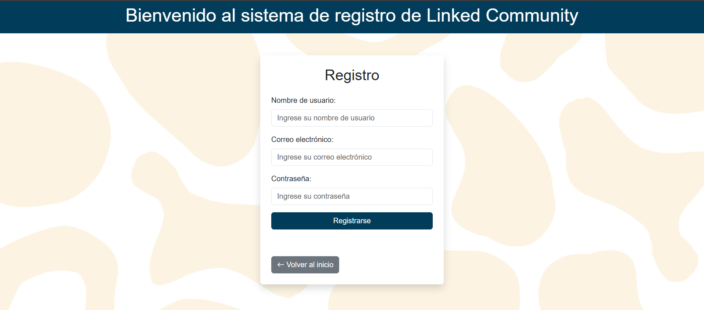
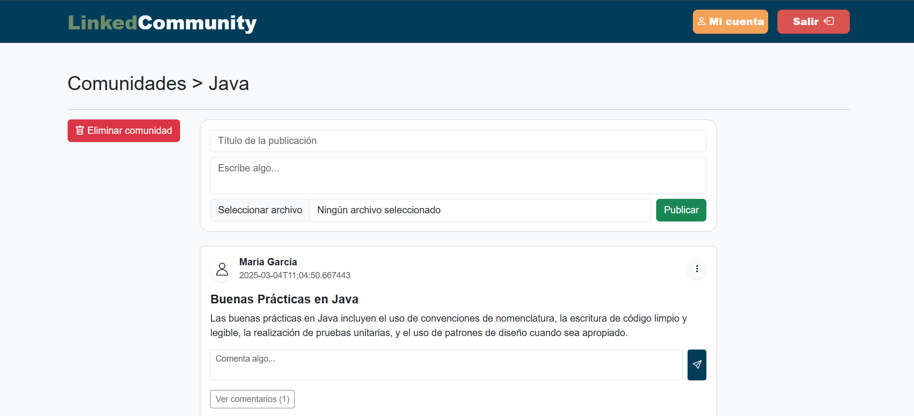

## **GROUP: 3**
| Name                   | Email                                |
|:------------------------:|:------------------------------------:|
| PABLO MARINAS BARBA      | p.marinas.2019@alumnos.urjc.es      |
| ALONSO DÍAZ SERRANO      | a.diaz.2019@alumnos.urjc.es        |
| NICOLAS VELEZ LEAL       | n.velez.2017@alumnos.urjc.es       |
| SERGIO ESPINOSA ROBLES   | s.espinosa.2020@alumnos.urjc.es    |

## **MEMBERS PARTICIPATION**

Cada miembro del equipo debe documentar su contribución a la práctica, incluyendo:

###  PABLO MARINAS BARBA 
- **Tareas realizadas:**
  
El proyecto ha sido desarrollado en equipo, organizándonos de manera paralela para avanzar de forma coordinada. En mi caso, me centré en la gestión del borrado de elementos, incluyendo usuarios, publicaciones y comunidades. Además, trabajé en el diseño y funcionamiento de la base de datos para garantizar que, al insertar datos, las tablas y relaciones se generaran correctamente. También me aseguré de que al eliminar un usuario, sus publicaciones y comunidades se eliminaran adecuadamente, basandome en la integracion de las relaciones entre entidades.
 
Dado que trabajamos en equipo, aunque algunos commits fueron realizados por un solo integrante, todos participamos activamente en la mayoría de los cambios. En varias ocasiones, trabajamos juntos desde uno o dos ordenadores para facilitar la comunicación y comprensión de las modificaciones en el código. Por ello, también colaboré en la creación de clases, configuración de servidores, archivos de configuración, plantillas y otros elementos clave del proyecto.

- **Commits más significativos:**
  1. [Creation of Services and relations](https://github.com/SSDD-2025/practica-sistemas-distribuidos-2025-grupo-3/commit/e7bed9770e6e3f8601c2f716a87d2a7a08717557)
  2. [Change of deletePost ot be on Service](https://github.com/SSDD-2025/practica-sistemas-distribuidos-2025-grupo-3/commit/4dc26ae6ebc95050a78b41988d9e80a0625501bc)
  3. [Delete of Posts](https://github.com/SSDD-2025/practica-sistemas-distribuidos-2025-grupo-3/commit/fc084ed554d4d64feefb25274b7eb5b9b359c525)
  4. [Creación de Base de datos](https://github.com/SSDD-2025/practica-sistemas-distribuidos-2025-grupo-3/commit/424b483386adc03e39f22df7d9c01a4aecb24907)
  5. [Merge branch 'main' of https://github.com/SSDD-2025/practica-sistemas-distribuidos-2025-grupo-3](https://github.com/SSDD-2025/practica-sistemas-distribuidos-2025-grupo-3/commit/ece8cf8dcd8fee3ab0d772dd27464d45a7650bca)

- **Ficheros con mayor participación:**
  1. [CommunityService.java](https://github.com/SSDD-2025/practica-sistemas-distribuidos-2025-grupo-3/blob/main/src/demo/src/main/java/com/example/demo/Service/CommunityService.java)
  2. [CommunityController.java](https://github.com/SSDD-2025/practica-sistemas-distribuidos-2025-grupo-3/blob/main/src/demo/src/main/java/com/example/demo/Controller/CommunityController.java)
  3. [Post.java](https://github.com/SSDD-2025/practica-sistemas-distribuidos-2025-grupo-3/blob/main/src/demo/src/main/java/com/example/demo/model/Post.java)
  4. [Community.java](https://github.com/SSDD-2025/practica-sistemas-distribuidos-2025-grupo-3/blob/main/src/demo/src/main/java/com/example/demo/model/Community.java)
  5. [application.properties](https://github.com/SSDD-2025/practica-sistemas-distribuidos-2025-grupo-3/blob/main/src/demo/src/main/resources/application.properties)

  ###  ALONSO DIAZ SERRANO 
- **Tareas realizadas:**
  - [Estructura básica (estilo) de como orientar la página, entidad comentario hecha, refactorizacion sobre logica de controlador-servicio-repositorio]
  - [Extra: hay algun tipo de problema con mi cuenta y los commits que hago desde el portatil y los commits que hago desde mi ordenador de escritorio de casa, hay como dos cuentas distintas de Alonso haciendo commits]
    
- **Commits más significativos:**
  1. [Commit 1](https://github.com/SSDD-2025/practica-sistemas-distribuidos-2025-grupo-3/commit/d58b4fee87292581ce1ac6d53d1b774d35c75608)
  2. [Commit 2](https://github.com/SSDD-2025/practica-sistemas-distribuidos-2025-grupo-3/commit/e321b5d59fb92dfbc49cbe1889b3d5ec9dd2a6a1)
  3. [Commit 3](https://github.com/SSDD-2025/practica-sistemas-distribuidos-2025-grupo-3/commit/0109b6195b8995777e9520fdbda85b114708f2bc)
  4. [Commit 4](https://github.com/SSDD-2025/practica-sistemas-distribuidos-2025-grupo-3/commit/283aab639907cd3da04bfb45f08ee8c318826d56)
  5. [Commit 5](https://github.com/SSDD-2025/practica-sistemas-distribuidos-2025-grupo-3/commit/3efccc357124f58a097e896dd74fd04ee618172a)

- **Ficheros con mayor participación:**
  1. [CommunityController.java](https://github.com/SSDD-2025/practica-sistemas-distribuidos-2025-grupo-3/blame/main/src/demo/src/main/java/com/example/demo/Controller/CommunityController.java)
  2. [community.html](https://github.com/SSDD-2025/practica-sistemas-distribuidos-2025-grupo-3/blame/main/src/demo/src/main/resources/templates/community.html)
  3. [CommunityService.java](https://github.com/SSDD-2025/practica-sistemas-distribuidos-2025-grupo-3/blob/main/src/demo/src/main/java/com/example/demo/Service/CommunityService.java)
  4. [CommentService.java](https://github.com/SSDD-2025/practica-sistemas-distribuidos-2025-grupo-3/blob/main/src/demo/src/main/java/com/example/demo/Service/CommentService.java)
  5. [CommentController.java](https://github.com/SSDD-2025/practica-sistemas-distribuidos-2025-grupo-3/blob/main/src/demo/src/main/java/com/example/demo/Controller/CommentController.java)

  ###  NICOLAS VELEZ LEAL
- **Tareas realizadas:**
  - [Descripción breve de las tareas realizadas]

- **Commits más significativos:**
  1. [Commit 1](URL_DEL_COMMIT_1)
  2. [Commit 2](URL_DEL_COMMIT_2)
  3. [Commit 3](URL_DEL_COMMIT_3)
  4. [Commit 4](URL_DEL_COMMIT_4)
  5. [Commit 5](URL_DEL_COMMIT_5)

- **Ficheros con mayor participación:**
  1. [Fichero 1](URL_DEL_FICHERO_1)
  2. [Fichero 2](URL_DEL_FICHERO_2)
  3. [Fichero 3](URL_DEL_FICHERO_3)
  4. [Fichero 4](URL_DEL_FICHERO_4)
  5. [Fichero 5](URL_DEL_FICHERO_5)

  ###  SERGIO ESPINOSA ROBLES 
- **Tareas realizadas:**
  - [Descripción breve de las tareas realizadas]

- **Commits más significativos:**
  1. [Commit 1](URL_DEL_COMMIT_1)
  2. [Commit 2](URL_DEL_COMMIT_2)
  3. [Commit 3](URL_DEL_COMMIT_3)
  4. [Commit 4](URL_DEL_COMMIT_4)
  5. [Commit 5](URL_DEL_COMMIT_5)

- **Ficheros con mayor participación:**
  1. [Fichero 1](URL_DEL_FICHERO_1)
  2. [Fichero 2](URL_DEL_FICHERO_2)
  3. [Fichero 3](URL_DEL_FICHERO_3)
  4. [Fichero 4](URL_DEL_FICHERO_4)
  5. [Fichero 5](URL_DEL_FICHERO_5)

## **NAVEGATION**

### Login

### Register

### Home

### Communities

### Incommunities

### Followers

### People

### Profile

### Edit

## Navigation Diagram

## **ENTITY DIAGRAM**

