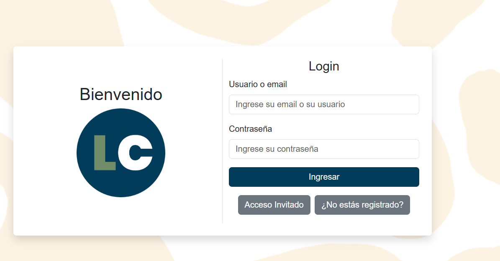
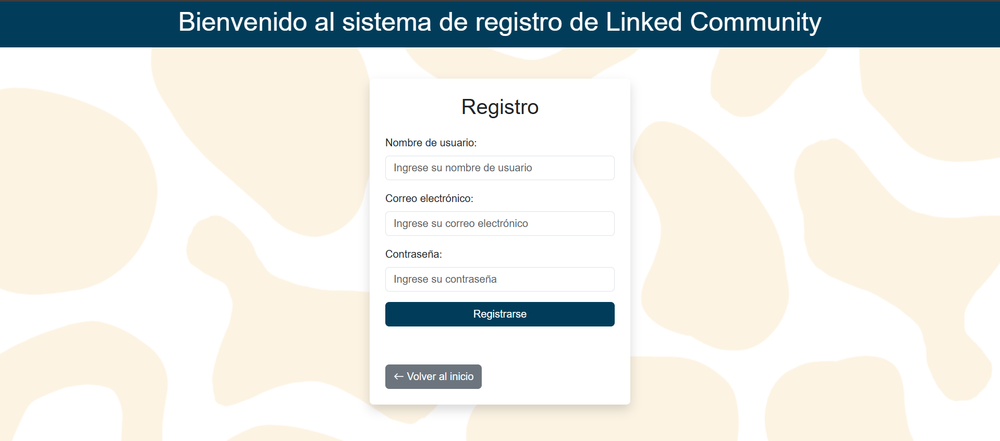
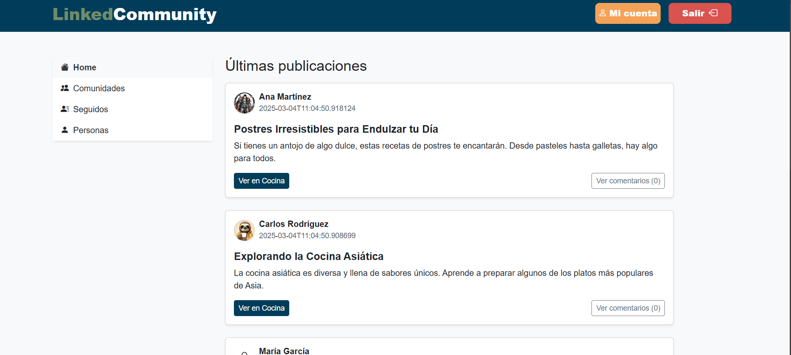
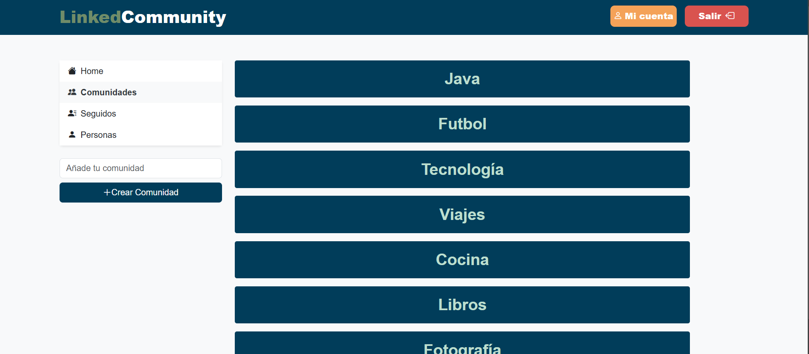
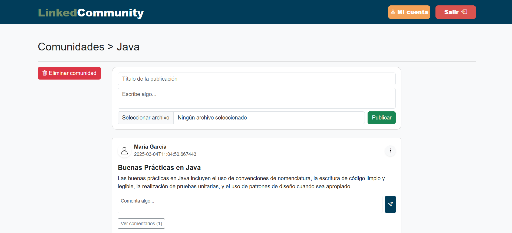
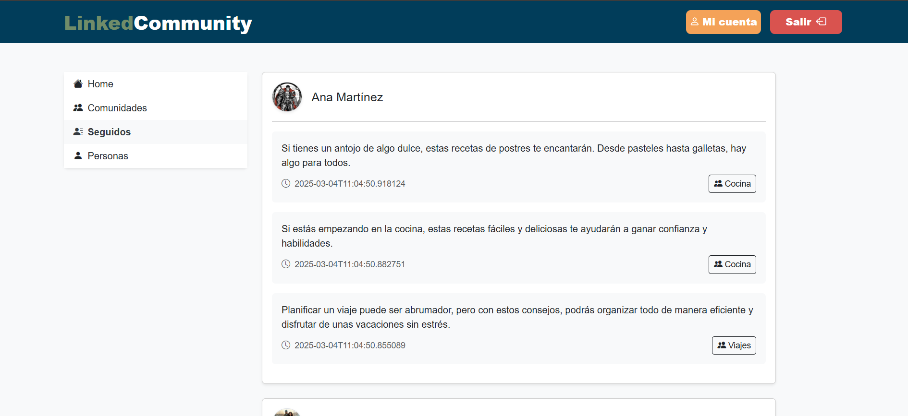
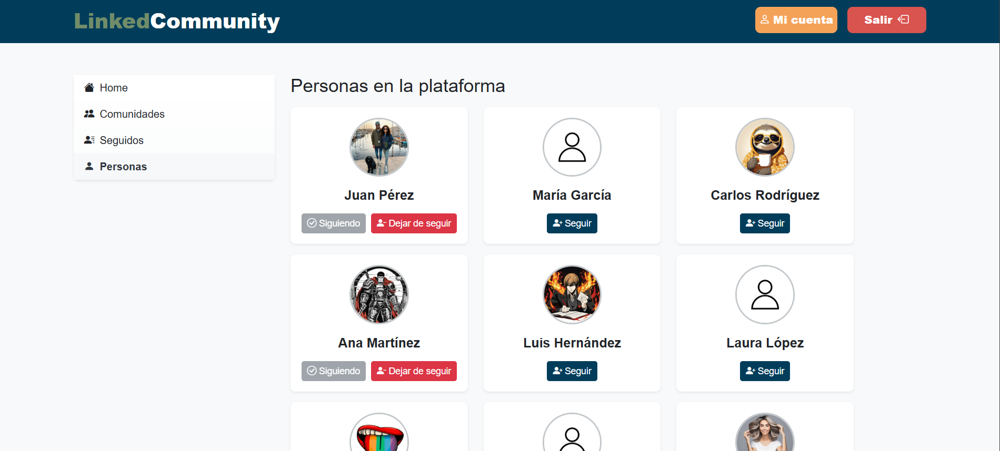
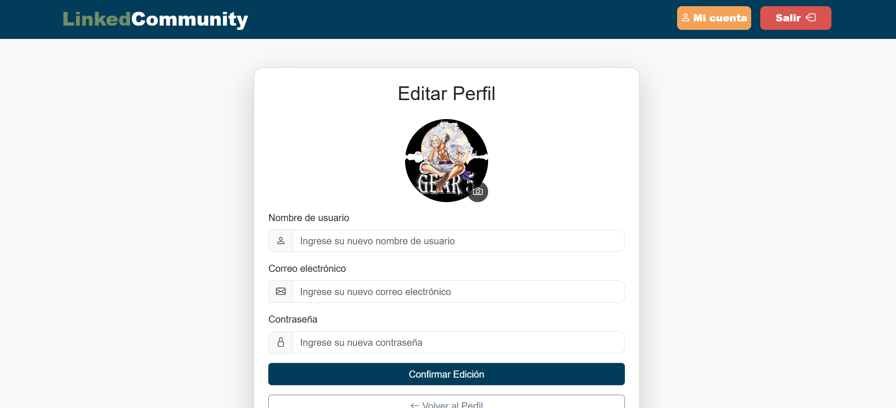

## **GROUP: 3**
| Name                   | Email                                |
|:------------------------:|:------------------------------------:|
| PABLO MARINAS BARBA      | p.marinas.2019@alumnos.urjc.es      |
| ALONSO DIAZ SERRANO      | a.diaz.2019@alumnos.urjc.es        |
| NICOLAS VELEZ LEAL       | n.velez.2017@alumnos.urjc.es       |
| SERGIO ESPINOSA ROBLES   | s.espinosa.2020@alumnos.urjc.es    |

## **NAVEGATION**

### Login

### Register

### Home

### Communities

### Incommunities

### Followers

### People

### Profile

### Edit

## Navigation Diagram

## **ENTITY DIAGRAM**

## **MEMBERS PARTICIPATION**

## **Participación de Miembros**

Cada miembro del equipo debe documentar su contribución a la práctica, incluyendo:

###  PABLO MARINAS BARBA 
- **Tareas realizadas:**
  - [Descripción breve de las tareas realizadas]

- **Commits más significativos:**
  1. [Commit 1](URL_DEL_COMMIT_1)
  2. [Commit 2](URL_DEL_COMMIT_2)
  3. [Commit 3](URL_DEL_COMMIT_3)
  4. [Commit 4](URL_DEL_COMMIT_4)
  5. [Commit 5](URL_DEL_COMMIT_5)

- **Ficheros con mayor participación:**
  1. [Fichero 1](URL_DEL_FICHERO_1)
  2. [Fichero 2](URL_DEL_FICHERO_2)
  3. [Fichero 3](URL_DEL_FICHERO_3)
  4. [Fichero 4](URL_DEL_FICHERO_4)
  5. [Fichero 5](URL_DEL_FICHERO_5)

  ###  ALONSO DIAZ SERRANO 
- **Tareas realizadas:**
  - [Descripción breve de las tareas realizadas]

- **Commits más significativos:**
  1. [Commit 1](URL_DEL_COMMIT_1)
  2. [Commit 2](URL_DEL_COMMIT_2)
  3. [Commit 3](URL_DEL_COMMIT_3)
  4. [Commit 4](URL_DEL_COMMIT_4)
  5. [Commit 5](URL_DEL_COMMIT_5)

- **Ficheros con mayor participación:**
  1. [Fichero 1](URL_DEL_FICHERO_1)
  2. [Fichero 2](URL_DEL_FICHERO_2)
  3. [Fichero 3](URL_DEL_FICHERO_3)
  4. [Fichero 4](URL_DEL_FICHERO_4)
  5. [Fichero 5](URL_DEL_FICHERO_5)

  ###  NICOLAS VELEZ LEAL
- **Tareas realizadas:**
  - [Descripción breve de las tareas realizadas]

- **Commits más significativos:**
  1. [Commit 1](URL_DEL_COMMIT_1)
  2. [Commit 2](URL_DEL_COMMIT_2)
  3. [Commit 3](URL_DEL_COMMIT_3)
  4. [Commit 4](URL_DEL_COMMIT_4)
  5. [Commit 5](URL_DEL_COMMIT_5)

- **Ficheros con mayor participación:**
  1. [Fichero 1](URL_DEL_FICHERO_1)
  2. [Fichero 2](URL_DEL_FICHERO_2)
  3. [Fichero 3](URL_DEL_FICHERO_3)
  4. [Fichero 4](URL_DEL_FICHERO_4)
  5. [Fichero 5](URL_DEL_FICHERO_5)

  ###  SERGIO ESPINOSA ROBLES 
- **Tareas realizadas:**
  - [Descripción breve de las tareas realizadas]

- **Commits más significativos:**
  1. [Commit 1](URL_DEL_COMMIT_1)
  2. [Commit 2](URL_DEL_COMMIT_2)
  3. [Commit 3](URL_DEL_COMMIT_3)
  4. [Commit 4](URL_DEL_COMMIT_4)
  5. [Commit 5](URL_DEL_COMMIT_5)

- **Ficheros con mayor participación:**
  1. [Fichero 1](URL_DEL_FICHERO_1)
  2. [Fichero 2](URL_DEL_FICHERO_2)
  3. [Fichero 3](URL_DEL_FICHERO_3)
  4. [Fichero 4](URL_DEL_FICHERO_4)
  5. [Fichero 5](URL_DEL_FICHERO_5)

